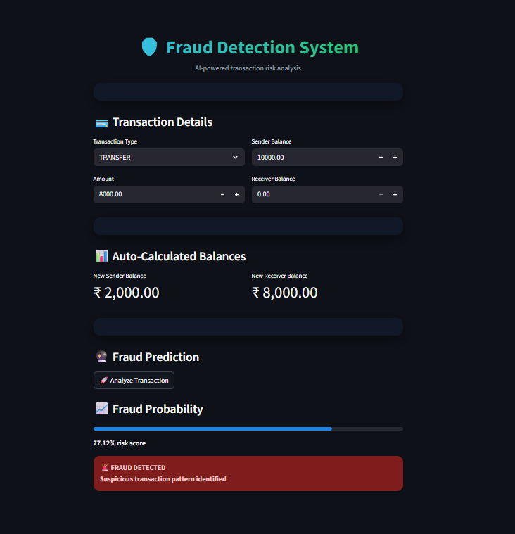

# Fraud Detection System

This project detects fraudulent financial transactions using Machine Learning.

## Web Application Preview




## Features
- Logistic Regression with class balancing
- Transaction behavior analysis
- Streamlit web application for real-time prediction

## Files
- `analysis_model.ipynb` – Model training and analysis
- `fraud_detection.py` – Streamlit app
- `fraud_detection_pipeline.pkl` – Trained ML pipeline

## Dataset
The dataset is not included due to GitHub file size limits.
Please download it separately and place it in the project root.

## How to Run
```bash
pip install -r requirements.txt
python -m streamlit run fraud_detection.py
